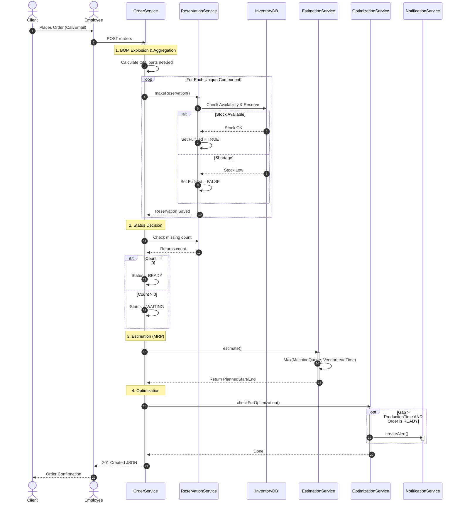
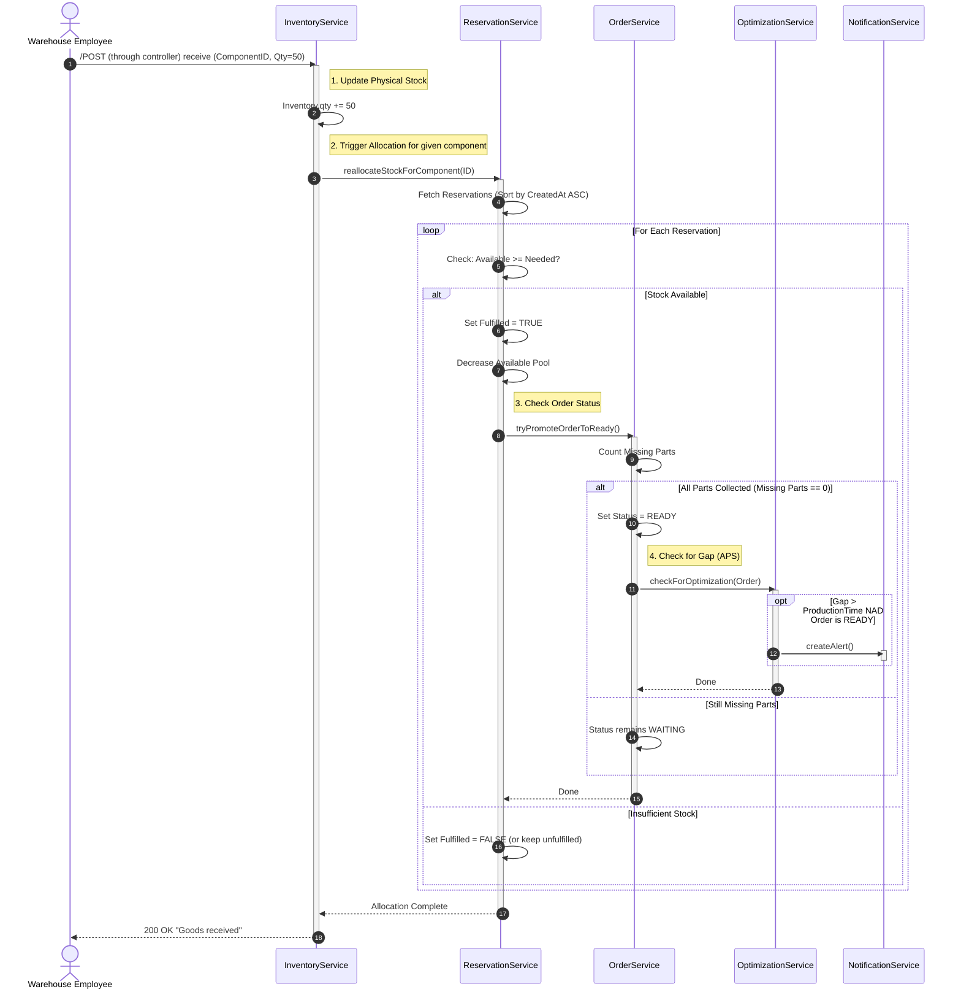
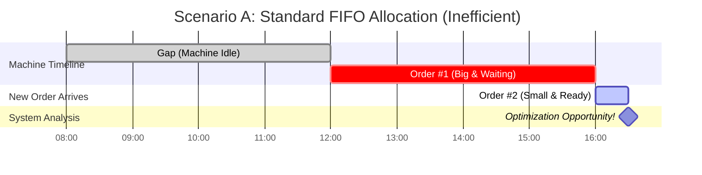
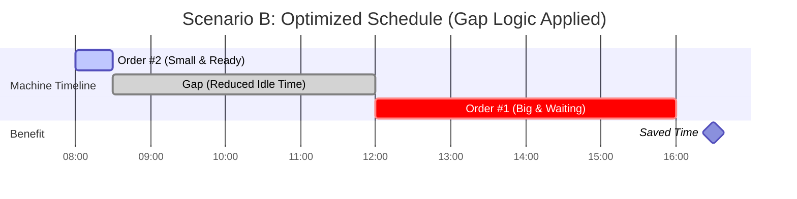

# SimpleERP

## 📑 Table of Contents
- [The Story Behind](#-introduction)
- [Tech Stack](#-tech-stack)
- [Core Workflows](#-core-workflows)
- [Optimization Logic (Gap Detection)](#-gap-logic-visualization-optimization)
- [Roadmap](#-roadmap)

## Introduction

During my internship at a manufacturing company, I got task to solve a critical bottleneck: the communication gap between Sales and Production Planning.

Sales representatives lacked real-time visibility into the production queue. To quote a lead time or check if a "rush order" was possible, they had to constantly interrupt Production Managers with phone calls. This manual back-and-forth wasted valuable time and often led to missed optimization opportunities.

I originally prototyped a solution using Excel macros and deep-nested formulas to bridge this gap. It worked, but it eventually grew into a 70MB monolith that was impossible to maintain and scale.

SimpleERP is my initiative to rebuild that logic the right way using Java and Spring Boot. It aims to solve real-world manufacturing problems by providing:

<ol>

<li>Instant Visibility for Sales: Front-line employees get immediate, accurate delivery estimates without needing to consult a manager.

</li>

<li>Automated Hints for Managers: The system proactively identifies "Queue Blocking" and suggests optimizations (e.g., squeezing small orders into idle windows) to maximize efficiency.</li>

</ol>

## Tech Stack

<ul>
<li>Java 24</li>
<li>Spring Boot 3 (Web, Data JPA)</li>
<li>Hibernate (ORM)</li>
<li>H2 Database (Dev/Test) </li>
<li>JUnit 5 & Mockito (Unit & Integration Testing)</li>
<li>Mermaid.js (Documentation & Visualization)</li>

    
</ul>

## Core Workflows

### Order Placement & Estimation Logic (MRP)
When a client places an order, the system performs a deep check of inventory, reserves components via **BOM Explosion**, and estimates the delivery date based on the bottleneck (Machine Availability vs. Vendor Lead Times).

### Automatic FIFO Allocation (The Waterfall Trigger)

The system reacts to inventory changes in real-time. When goods are received, they are instantly allocated to the oldest waiting orders (FIFO Strategy), potentially unlocking them for production.

## Gap logic vizualization (Optimization)

Standard MRP systems often rely on a rigid FIFO strategy. While safe, this creates inefficiencies. If a high-priority order is blocked due to missing materials, the machine remains idle.
SimpleERP optimizes this by proactively monitoring the schedule for idle time windows and identifying "jumper" candidates—smaller, ready-to-produce orders that fit within the gap.

### Scenario A: Standard FIFO (Inefficient)

The machine sits idle for 4 hours waiting for Order #1.

### Scenario B: Optimized Schedule

The system generates a Real-time Alert for the Production Manager, suggesting an immediate schedule override. Order #2 is executed during the idle time.

## Roadmap

This project is under active development. I am currently focusing on refactoring the codebase to unify patterns learned throughout the development process.

### Upcoming Features:

<ul>

<li>[ ] Queue Management API: Endpoints for the Production Manager to drag-and-drop orders (accepting optimization suggestions).</li>

<li>[ ] Security: Implementing Spring Security (JWT) for role-based access (Warehouse vs. Production Manager).</li>

<li>[ ] Multi-Machine Support: Logic to handle multiple production lines simultaneously.</li> 

<li>[ ] Dockerization: Containerizing the application for easier deployment.</li>

</ul>

