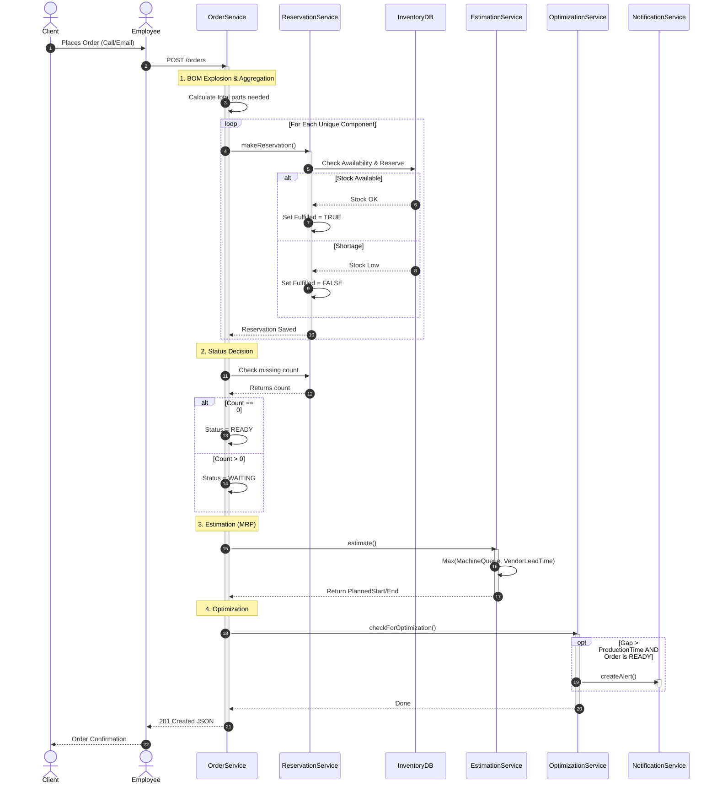
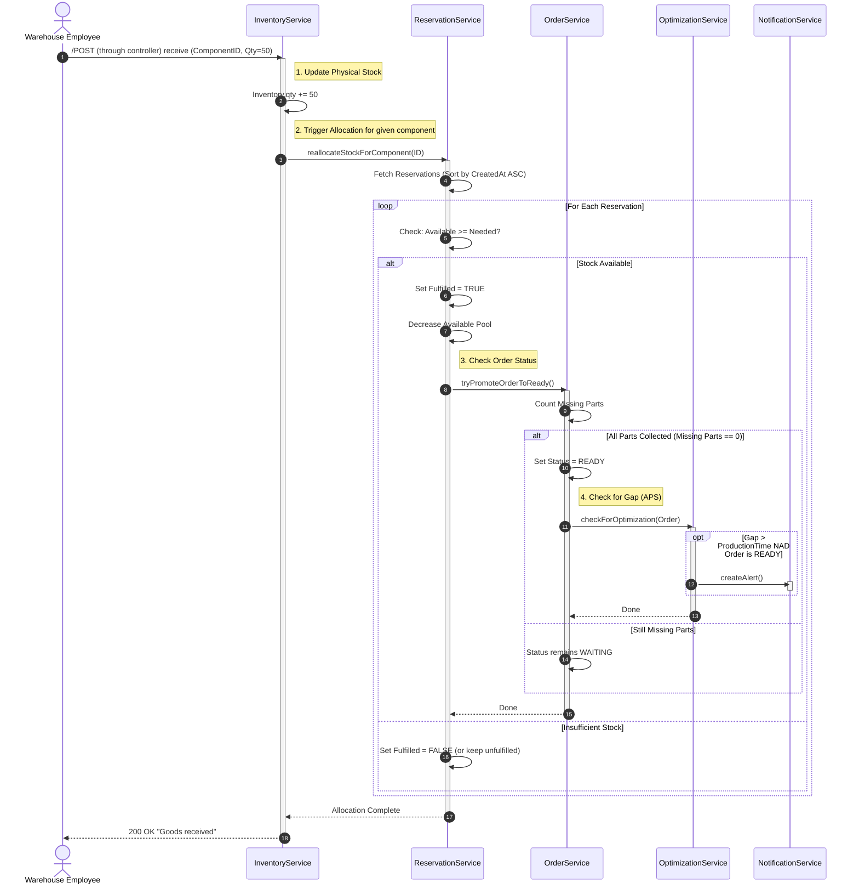
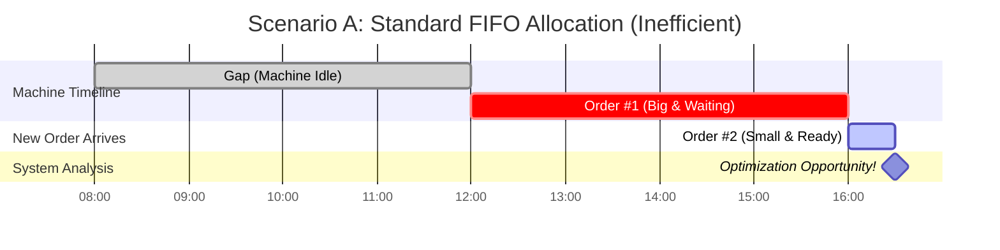
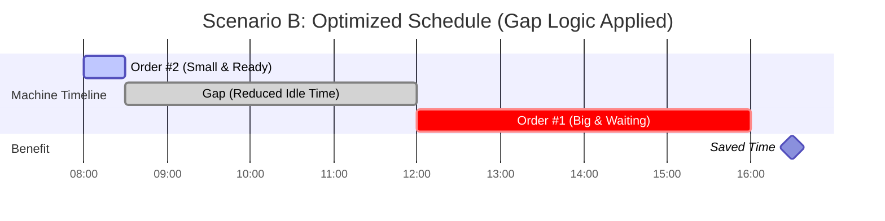

# SimpleERP

## 📑 Table of Contents
- [Introduction](#introduction)
- [Tech Stack](#tech-stack)
- [Core Workflows](#core-workflows)
    - [Order placement](#order-placement-and-estimation-logic)
    - [Automatic FIFO Allocation](#automatic-fifo-allocation)
- [Optimization Logic (Gap Detection)](#gap-logic-optimization-vizualization)
    - [Scenario A](#scenario-a-standard-fifo-inefficient)
    - [Scenario B](#scenario-b-optimized-schedule) 
- [Roadmap](#roadmap)
- [How to run](#how-to-Run)
- [Testing scenarios](#testing-scenarios)


## Introduction

During my internship at a manufacturing company, I got task to solve a critical bottleneck: the communication gap between Sales and Production Planning.

Sales representatives lacked real-time visibility into the production queue. To quote a lead time or check if a "rush order" was possible, they had to constantly interrupt Production Managers with phone calls. This manual back-and-forth wasted valuable time and often led to missed optimization opportunities.

I originally prototyped a solution using Excel macros and deep-nested formulas to bridge this gap. It worked, but it eventually grew into a 70MB monolith that was impossible to maintain and scale.

SimpleERP is my initiative to rebuild that logic the right way using Java and Spring Boot. It aims to solve real-world manufacturing problems by providing:

<ol>

<li>Instant Visibility for Sales: Front-line employees get immediate, accurate delivery estimates without needing to consult a manager.

</li>

<li>Automated Hints for Managers: The system proactively identifies "Queue Blocking" and suggests optimizations (e.g., squeezing small orders into idle windows) to maximize efficiency.</li>

</ol>


## Tech Stack

<ul>
<li>Java 25</li>
<li>Spring Boot 3 (Web, Data JPA)</li>
<li>Hibernate (ORM)</li>
<li>H2 Database (Dev/Test) </li>
<li>JUnit 5 & Mockito (Unit & Integration Testing)</li>
<li>Mermaid.js (Documentation & Visualization)</li>

    
</ul>


## Core Workflows

### Order Placement and Estimation Logic
When a client places an order, the system performs a deep check of inventory, reserves components via **BOM Explosion**, and estimates the delivery date based on the bottleneck (Machine Availability vs. Vendor Lead Times).


### Automatic FIFO Allocation

The system reacts to inventory changes in real-time. When goods are received, they are instantly allocated to the oldest waiting orders (FIFO Strategy), potentially unlocking them for production.




## Gap logic optimization vizualization 
Standard MRP systems often rely on a rigid FIFO strategy. While safe, this creates inefficiencies. If a high-priority order is blocked due to missing materials, the machine remains idle.
SimpleERP optimizes this by proactively monitoring the schedule for idle time windows and identifying "jumper" (smaller and ready to produce orders that fit within the gap).

### Scenario A: Standard FIFO (Inefficient)

The machine sits idle for 4 hours waiting for Order #1.




### Scenario B: Optimized Schedule

The system generates a Real-time Alert for the Production Manager, suggesting an immediate schedule override. Order #2 is executed during the idle time.





## Roadmap

This project is under active development. I am currently focusing on refactoring the codebase to unify patterns learned throughout the development process.

### Upcoming Features:

<ul>

<li>[ ] Queue Management API: Endpoints for the Production Manager to drag-and-drop orders (accepting optimization suggestions).</li>

<li>[ ] Security: Implementing Spring Security (JWT) for role-based access (Warehouse vs. Production Manager).</li>

<li>[ ] Multi-Machine Support: Logic to handle multiple production lines simultaneously.</li> 

<li>[X] Dockerization: Containerizing the application for easier deployment.</li>

</ul>

## How to Run

### Prerequisites
* **Java 25** installed (if running locally)
* Docker & Docker Desktop (recommended)
* **Git**

### 1. Clone the repository
```bash
git clone https://github.com/Antizore/SimpleERP.git
cd SimpleERP
```
### 2. Build
#### Option (A): Run with Docker (Recommended)

```Bash
docker compose up --build
```

#### Option (B): Run locally
Using the Maven Wrapper:
```bash
./mvnw clean install
```
(On Windows PowerShell use: .\mvnw clean install)

Run the application

```bash
./mvnw spring-boot:run
```
### 3. Access the Application

Once the application is running, you can access the following endpoints:
<ul>
<li>
    API Documentation (Swagger UI):
    <ul>
        <li>http://localhost:8080/swagger-ui/index.html</li>
        <li>Use this to test endpoints like POST /orders directly from your browser.</li>
    </ul>
</li>
    
<li>
    H2 Database Console: 
    <ul>
        <li>http://localhost:8080/h2-console</li>
        <li>Driver Class: org.h2.Driver</li>
        <li>JDBC: jdbc:h2:mem:testdb</li>
        <li>User Name: sa</li>
        <li>Password: (leave empty)</li>
    </ul>
</li>
</ul>
   
### 4. Run Tests

To verify the logic (Unit & Integration tests):
```bash
./mvnw test
```


## Testing Scenarios

The following scenarios outline the functional verification of the SimpleERP core engine. These cases cover inventory allocation, scheduling bottlenecks, and the optimization logic used to minimize machine idle time.

### Scenario 1: Immediate Order Fulfillment (Standard Process)
**Objective:** To verify that the system correctly identifies available inventory and schedules production for the earliest possible slot.
* **Preconditions:** All components required for Product ID 1 are present in the `INVENTORY` table with sufficient quantity to meet the Bill of Materials (BOM) requirements.
* **Execution:** Submit a `POST` request to `/orders` for Product ID 1.
* **Expected Results:**
    * The order status is updated to `READY`.
    * The `planned_start_at` timestamp is synchronized with the current time or the next available machine opening.
    * All associated `stock_reservation` records are flagged as `is_fulfilled = true`.

### Scenario 2: Lead Time Calculation (Inventory Shortage)
**Objective:** To ensure the scheduling engine accurately accounts for vendor delays when primary components are out of stock.
* **Preconditions:** Product ID 2 requires a specific component currently at zero stock. The component metadata defines a 7-day **Vendor Lead Time**.
* **Execution:** Submit an order request for Product ID 2.
* **Expected Results:**
    * The order status is set to `WAITING`.
    * The `planned_start_at` is calculated as $T + 7$ days (where $T$ represents the current date).
    * The `EstimationService` identifies the specific component causing the scheduling bottleneck in the system logs.

### Scenario 3: FIFO Allocation Logic (Stock Inbound)
**Objective:** To validate that the system prioritizes older orders (First-In, First-Out) when new stock is received in the warehouse.
* **Execution:**
    1. Create **Order A** (Qty: 10) followed by **Order B** (Qty: 5). Both orders enter `WAITING` status due to stock deficiency.
    2. Submit a stock update to `/inventory/receive` for 12 units of the required component.
* **Expected Results:**
    * **Order A** transitions to `READY` status (utilizing 10 units of the new stock).
    * **Order B** remains in `WAITING` status (utilizing the remaining 2 units, but maintaining a deficiency of 3 units).
    * The physical inventory level is adjusted to zero to reflect the allocation to the reservation pool.

### Scenario 4: Production Gap Optimization (Jumper Logic)
**Objective:** To test the `OptimizationService`'s ability to maximize machine utilization by reordering the queue when a primary order is blocked.
* **Context:** A high-priority "Blocker Order" is scheduled five days in the future, leaving a significant idle window in the current machine timeline.
* **Execution:** Place an order for a "Small/Fast" product that has all components available and is currently `READY` for production.
* **Expected Results:**
    * The `OptimizationService` identifies the idle window preceding the "Blocker Order."
    * The `NotificationService` triggers an alert to the Production Manager suggesting a schedule override.
    * The system validates that the "Small/Fast" order can be completed within the gap without impacting the "Blocker Order's" original completion estimate.
