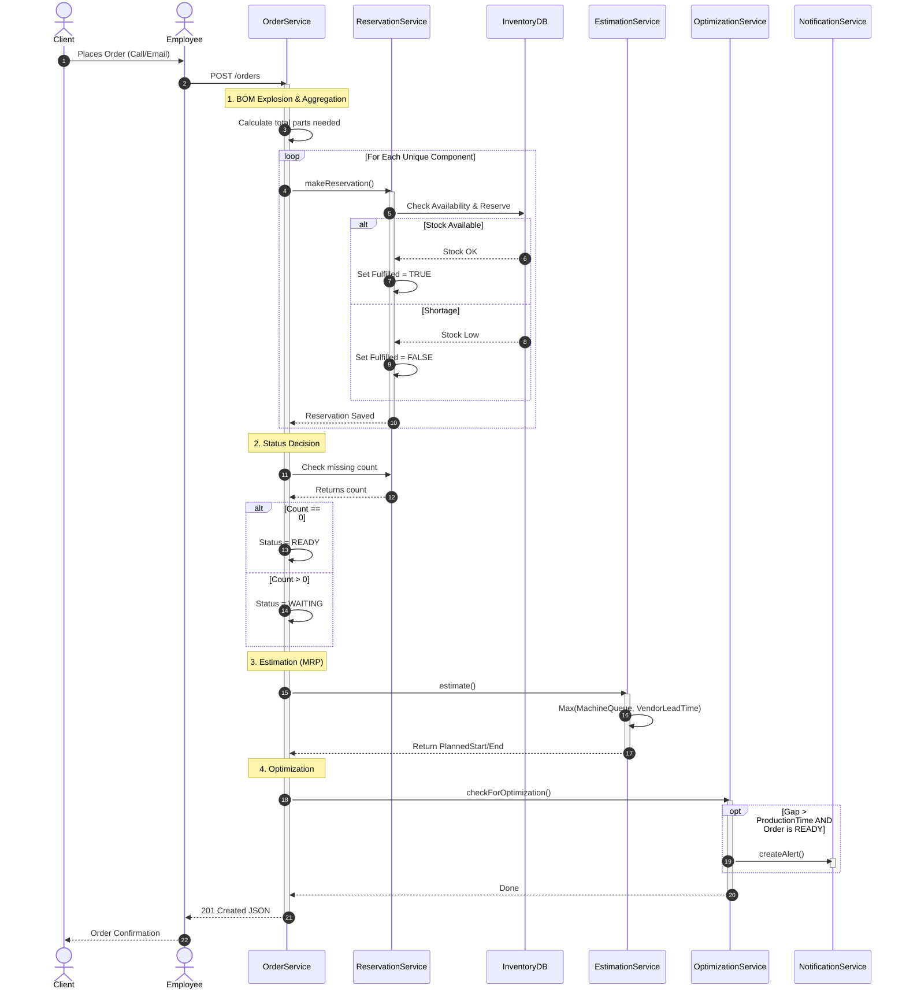
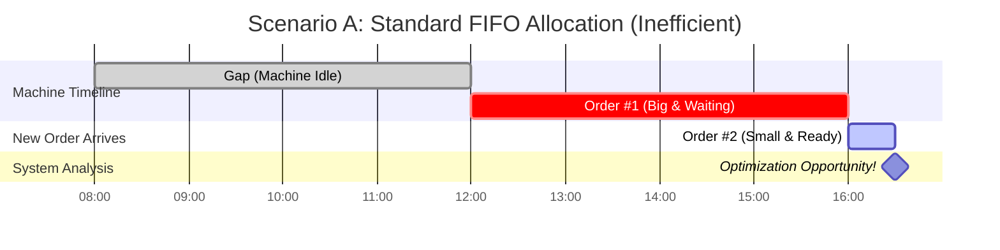
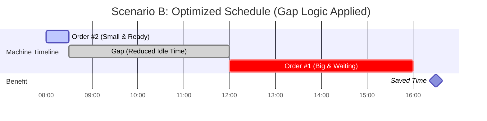

# SimpleERP

## Flow chart for creating new order:

## Gap logic vizualization

Standard MRP systems often rely on a rigid FIFO (First-In, First-Out) strategy. While safe, this approach creates inefficiencies. If a high-priority order is blocked due to missing materials (e.g., waiting for vendor delivery) as shown below, the production machine remains idle, wasting valuable capacity. We can optimize it by actively monitors the schedule for idle time windows and identifies "jumper" candidates (smaller orders that are fully stocked (READY)) and suggest that there is possibility of fitting it within the idle window.

The system generates a Real-time Alert for the Production Manager, suggesting an immediate schedule override. This allows Order #2 to be executed during the idle time of Order #1, without delaying the main schedule.

