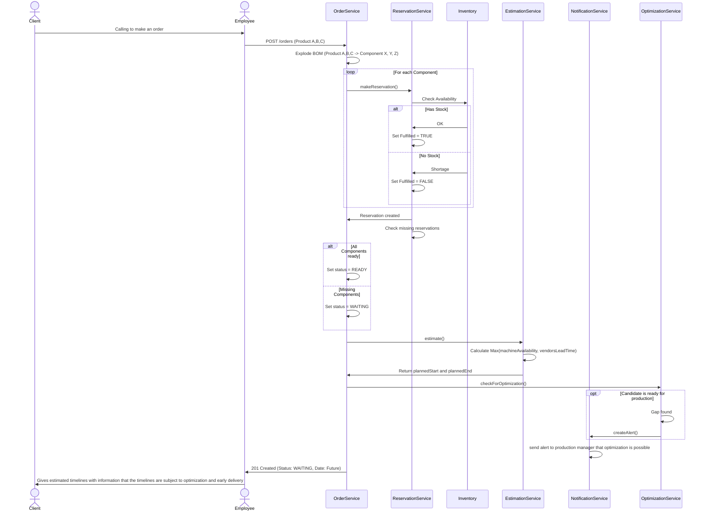

# SimpleERP

Flow chart for creating new order:

```mermaid

sequenceDiagram
    Actor Client
    Actor Employee
    participant OrderService
    participant ReservationService
    participant Inventory
    participant EstimationService
    participant NotificationService

    Client->>Employee: Calling to make an order
    Employee->>OrderService: POST /orders (Product A,B,C)
    OrderService->>OrderService: Explode BOM (Product A,B,C -> Component X, Y, Z)
    
    loop For each Component
        OrderService->>ReservationService: makeReservation()
        ReservationService->>Inventory: Check Availability
        alt Has Stock
            Inventory ->> ReservationService: OK
            ReservationService->>ReservationService: Set Fulfilled = TRUE
        else No Stock
            Inventory ->> ReservationService: Shortage
            ReservationService->>ReservationService: Set Fulfilled = FALSE
        end
    end

    ReservationService->>OrderService: Reservation created
    ReservationService->>ReservationService: Check missing reservations

    alt All Components ready
      OrderService->>OrderService: Set status = READY
    else Missing Components
      OrderService->>OrderService: Set status = WAITING
    end

    OrderService->>EstimationService: estimate()
    EstimationService->>EstimationService: Calculate Max(machineAvailability, vendorsLeadTime)
    EstimationService->>OrderService: Return plannedStart and plannedEnd

    OrderService->>OptimizationService: checkForOptimization()

    opt Candidate is ready for production
      OptimizationService->>OptimizationService: Gap found
      OptimizationService->>NotificationService: createAlert()
    end
    NotificationService->>NotificationService: send alert to production manager that optimization is possible
     
    OrderService->>Employee: 201 Created (Status: WAITING, Date: Future)
    Employee->>Client: Gives estimated timelines with information that the timelines are subject to optimization and early delivery

```

